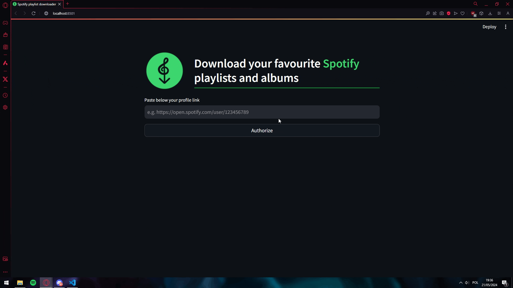

<h1 align="center">🎶Spotify-playlist-downloader</h1>

## Table of Contents

 - [First look](https://github.com/maciekmalachowski/Spotify-playlist-downloader#first-look)
 - [Installation](https://github.com/maciekmalachowski/Spotify-playlist-downloader#installation)
 - [How it works](https://github.com/maciekmalachowski/Spotify-playlist-downloader#how-it-works)
 - [App appearance](https://github.com/maciekmalachowski/Spotify-playlist-downloader#app-appearance)

<br>
 
<h1 align="center" id="first-look"> First look 👀 </h1>

### With this app, we can confidently download our favorite playlists and albums from Spotify *(legally, I think)*. 
### The app is based on `Spotipy` and has a very intuitive user interface written in the `Streamlit`. 
### Downloading is provided to us by the `Pytube`.

<br>

<h1 align="center" id="installation">Installation ℹ</h1>

- First of all, clone this repository on your device. Open your shell and paste the following commands:

*URL cloning*
```
git clone https://github.com/maciekmalachowski/Spotify-playlist-downloader.git
```
*SSH cloning*
```
git clone git@github.com:maciekmalachowski/Spotify-playlist-downloader.git
```
<br>

- Then you need to install the requirements contained in `requirements.txt`.
```
pip install -r requirements.txt
```
- Last but not least, create a `.env` file and paste the following code there:
```
SPOTIPY_CLIENT_ID=`your_spotipy_client_id''
SPOTIPY_CLIENT_SECRET='your_spotipy_client_secret'
SPOTIPY_REDIRECT_URI='https://google.com/'
```
where `your_spotipy_client_id` and `your_spotipy_client_secret` are your own keys. [Check out how to get them](https://developer.spotify.com/documentation/web-api/concepts/apps)

*Please note that `SPOTIPY_REDIRECT_URI` must be equal to `https://google.com/`*

<br>

- After that run `internal streamlit server` in the repository folder.
```
streamlit run app.py
```
Streamlit will launch the *app.py* file contained in the folder and *automatically* display it in the browser. 

<br>

<h1 align="center" id="how-it-works">How it works 🤔</h1>

### At first, the application asks us for a link to our Spotify profile. 
### Then it redirects us to https://google.com/. We have to copy the whole link and paste it into the terminal, where it automatically asks us for it. 
### After this step, Spotipy reads our liked albums and created playlists with their songs. 
### We can confidently choose what we want to download and then press the download button. 
### In the meantime, the Pytube library searches YouTube for the names of our songs and downloads them at the indicated location. 
### When the download is complete, we get the appropriate message.

<br>

<h1 align="center" id="app-appearance"> App appearance 🔍</h1>

<h4 align="center"> The user unterface is prepared to guide the user step-by-step.</h4>




